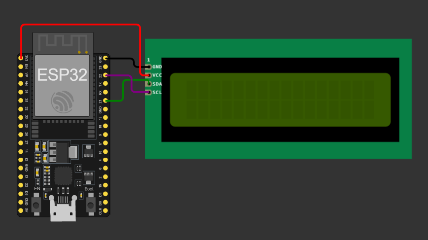
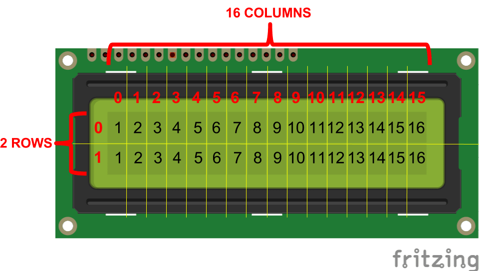

# Let's code

To see if everything is working you can click the **Green Play Button** and watch it do **ｎｏｔｈｉｎｇ**! (just prints "Hello, ESP32!").
Then you can stop the simulation before your computer does a "spectacular firework show"!

## Code Explained

```cpp
void setup() {
  ...
}

void loop() {
  ...
}

```

You might have noticed that there are two void functions, they are void because they only take inputs, think of it as a... void. The two functions are named `setup` and `loop`, the difference between them is that the `setup` function only runs once, while the `loop` function runs all the time, looping...

---

```cpp
Serial.begin(115200);
```

This line of code initializes the serial comunication so that you can interact using text with it. The number 115200 is basically the speed of comunication and it's in *"bits per second"*/*bps*, so 115k bits are being sent per second, but only when a message is sent.

---

```cpp
Serial.println("Hello, ESP32!");
```

This line of code sends the text `Hello, ESP32!` along with a newline and carriage return (`\n`, `\r`) characters to the serial port. These characters go way back to the starting  days of computing, where the newline character would send the printer head to the next line and the carriage return would return the head to the start of said line.

---

```cpp
delay(10);
```

This line of code makes the ESP32 **die** for 10 miliseconds. I said die because while on delay, the ESP32 **does not do anything**. This is important if you want to make some kind of multitasking, because with the arduino firmware, you only have one thread to execute code. (unless you know how to)

## Making the Clock

### Importing Libraries

Once you have your project ready, go ahead to the `Library Manager` and add the `LiquidCrystal I2C` Library.

### Adding a screen

After installing the library, over on the `Simulation` side, add a `LCD 16x2 (I2C)` component.
Connect the pins up to the ESP32 in this way. We'll use the I2C protocol. It's basically a way of transfering data using two wires, one for Inbound, and one for Outbound.

| LCD | ESP |
| --- | --- |
| VCC | 3V3 |
| GND | GND |
| SDA |  21 |
| SCL |  22 |

Your project should look like this:



### Part 1

Copy this code block below to your project. This code contains the basic setup for the clock.

```cpp
//Libraries
#include <WiFi.h>
#include <Wire.h>
#include <LiquidCrystal_I2C.h>

LiquidCrystal_I2C LCD = LiquidCrystal_I2C(0x27, 16, 2); //Define LCD object

#define NTP_SERVER     "pool.ntp.org"//
#define UTC_OFFSET     0             // Set some constants
#define UTC_OFFSET_DST 0             //

void spinner() { //do a fancy animation
  static int8_t counter = 0;
  const char* glyphs = "\xa1\xa5\xdb";
  LCD.setCursor(15, 1);
  LCD.print(glyphs[counter++]);
  if (counter == strlen(glyphs)) {
    counter = 0;
  }
}
```

This code contains the library imports, defines the LCD object, sets some constants and creates a `spinner` function that adds some dots while connecting.
The LCD works like this:


