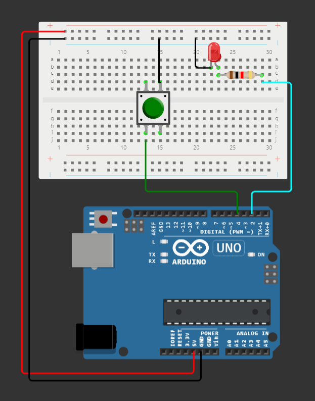
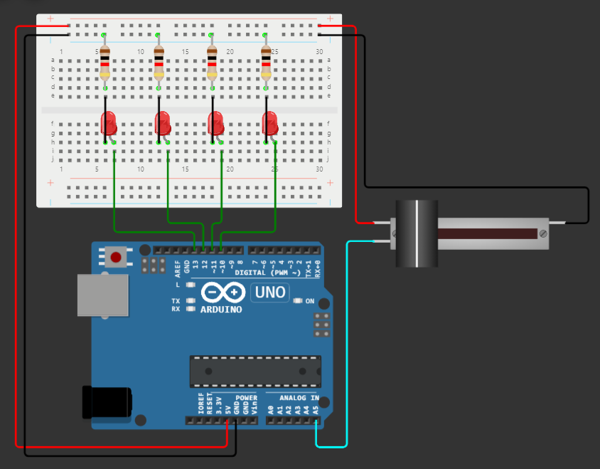

# Let's code

To see if everything is working you can click the  button and watch it do **ｎｏｔｈｉｎｇ**!.
Then you can stop the simulation before your computer does a "spectacular firework show".

## Code Explained

```cpp
void setup() {
  ...
}

void loop() {
  ...
}

```

You might have noticed that there are two void functions, they are void because they only take inputs, think of it as a... void. The two functions are named `setup` and `loop`, the difference between them is that the `setup` function **only runs once**, while the `loop` function runs all the time, **looping**...

## The first steps

In this first project we will:

- Learn how to use the digital ports
- Learn how to use the analog ports

### Digital Ports

For this step we will need:

- 1x `Half Breadboard`
- 1x `LED`
- 1x `Resistor`
- 1x `Pushbutton`

Make the circuit below:



Now we are goin to start coding, and for that, we will need some functions...

---

```cpp
Serial.begin(115200);
```

This line of code initializes the serial comunication so that you can interact using text with it. The number 115200 is basically the speed of comunication and it's in *"bits per second"*/*bps*, so 115k bits are being sent per second, but only when a message is sent.
This line should only be run inside the `setup` function once.

---

```cpp
Serial.println("Hello, Arduino!");
```

This line of code sends the text `Hello, Arduino!` along with a newline and carriage return (`\n`, `\r`) characters to the serial port. These characters go way back to the starting  days of computing, where the newline character would send the printer head to the next line and the carriage return would return the head to the start of said line. You can run this function wherever you like.

---

```cpp
delay(10);
```

This line of code makes the Arduino **die** for 10 miliseconds. I said die because while on delay, the Arduino **does not do anything**. This is important if you want to make some kind of multitasking, because with the arduino firmware, you only have one thread to execute code. (unless you know how to change that). This line is mostly used for simple wait periods, or slowing down the arduino processing. You can run this function wherever you like.

Remember, you can always go to the [official arduino reference](https://www.arduino.cc/reference/en/).

If you put all this knowledge to use, you should end up with this piece of code:

```cpp
void setup() {
  Serial.begin(115200);
  Serial.println("Hello, Arduino");
}

void loop() {
  // put your main code here, to run repeatedly:
  delay(10);
}
```

Now, we are going to make it so, when you press the button, the LED lights up! For that we will read the state of the pin the button is connected to (`HIGH` or `LOW`, depending on the circuit).

Note: For some reason, the inverted logic seems to work better in Wokwi.

---

First thing we need to to is tell the pin what it does, and for that we can use:

```cpp
pinMode(pin, mode) //ex. INPUT, INPUT_PULLUP or OUTPUT
```

Info about all pin modes is [here](https://docs.arduino.cc/learn/microcontrollers/digital-pins/)

---

To read the state of the button we will use...

```cpp
digitalRead(4); // 4 is the pin the button is connected to, you can use a variable instead
```

... and this will return either a 1 or a 0, and because arduino is cool, you have some predefined words you can use to better understand the code, `HIGH` or `LOW`, respectively.

---

If we use the `if/else` statement we can do an action if the condition is met, for example:

```cpp
if (digitalread(4) == HIGH){ // if the state of the pin is HIGH,
    ...                      //do a thing.
} else {                     //if it's not,
    ...                      //do a diferent thing.
}
```

---

Just like the way you can read pin states, you can write them too! Using the ...

```cpp
digitalWrite(2, HIGH) // this sets pin 2 to HIGH
```

---

From all this knowledge we gained, we can put together a simple program that, when you press the button, the led lights up!

```cpp
void setup() {
  Serial.begin(115200);
  Serial.println("Hello, Arduino");
  pinMode(4, INPUT_PULLUP);
  pinMode(2, OUTPUT);
}

void loop() {
  if (digitalRead(4) == LOW){
    digitalWrite(2, HIGH);
  } else {
    digitalWrite(2, LOW);
  }
}
```

Don't forget to save your work!

### Analog Ports

[Create a new project](https://wokwi.com/projects/new/arduino-uno), and add the following parts:

- 1x `Half Breadboard`
- 4x `LED`s
- 4x `Resistors`
- 1x `Slide Potentiometer`

---

***Quick binary lesson***

The analog pins in the arduino are 10-bit, so the maximum value of the read is 1023(5v), and that is `0b1111111111`(ten ones) in binary. Think of the 10-Bit as a resolution, the more bits, the more granular control you have.

---

Put the components together like this:



We are going to make a slider that turns on LEDs based on it's position. First, we need to get the position of the slider by reading the analog value of the pin it's connected to.

We can do this by using the...

```cpp
analogRead(5) //returns an integer in the 0-1023 range, 10-bit
```

... function and assigning it to a variable `sliderValue`.

Next, we can define custom ranges with `if` statements, and turn the LEDs on or off accordingly.

```cpp
void loop() {
  sliderValue = analogRead(5); //do not confuse analog pin 5 with digital 5
  //(1024/4)-1 = 255
  if (sliderValue == 0) {
    digitalWrite(13, LOW);
    digitalWrite(12, LOW);
    digitalWrite(11, LOW);
    digitalWrite(10, LOW);
    Serial.println("0");
  }else if (sliderValue <= 255){
    digitalWrite(13, HIGH);
    digitalWrite(12, LOW);
    digitalWrite(11, LOW);
    digitalWrite(10, LOW);
    Serial.println("1");
  } else if (sliderValue <= 255+255) {
    digitalWrite(13, HIGH);
    digitalWrite(12, HIGH);
    digitalWrite(11, LOW);
    digitalWrite(10, LOW);
    Serial.println("2");
  } else if (sliderValue <= 255+255+255) {
    digitalWrite(13, HIGH);
    digitalWrite(12, HIGH);
    digitalWrite(11, HIGH);
    digitalWrite(10, LOW);
    Serial.println("3");
  } else if (sliderValue >= 255+255+255+255) {
    digitalWrite(13, HIGH);
    digitalWrite(12, HIGH);
    digitalWrite(11, HIGH);
    digitalWrite(10, HIGH);
    Serial.println("4");
  }
}
```

Now, you can press the  button and test your work!
